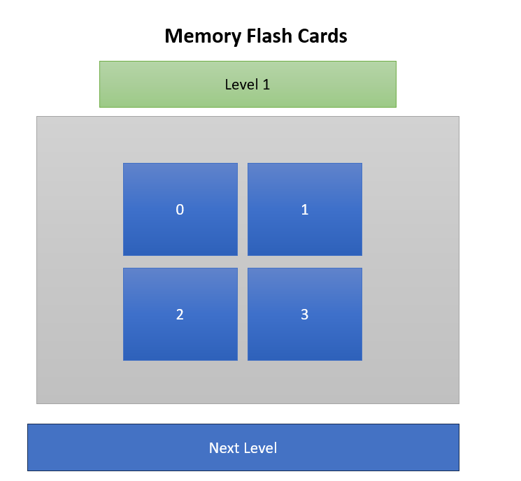
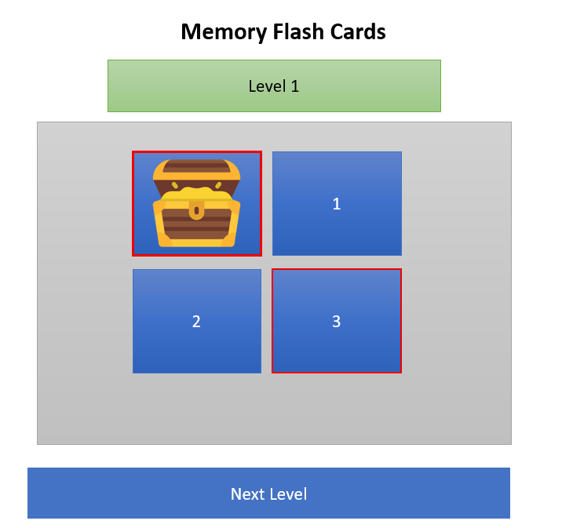
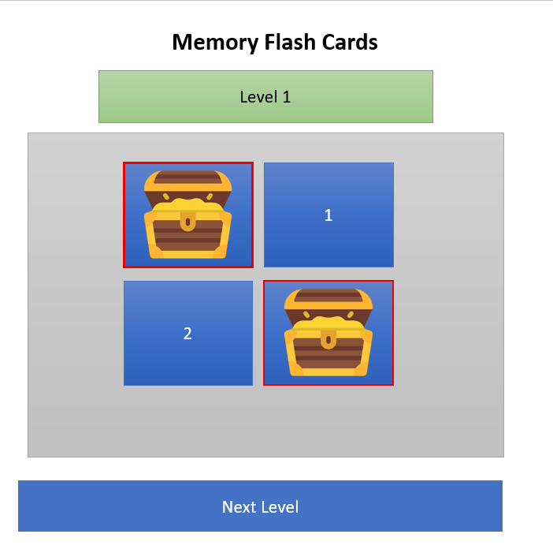
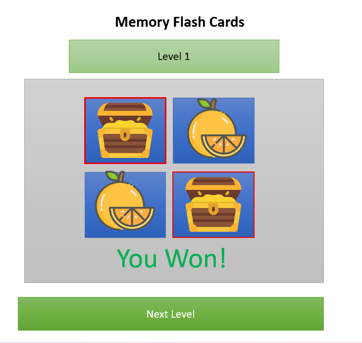
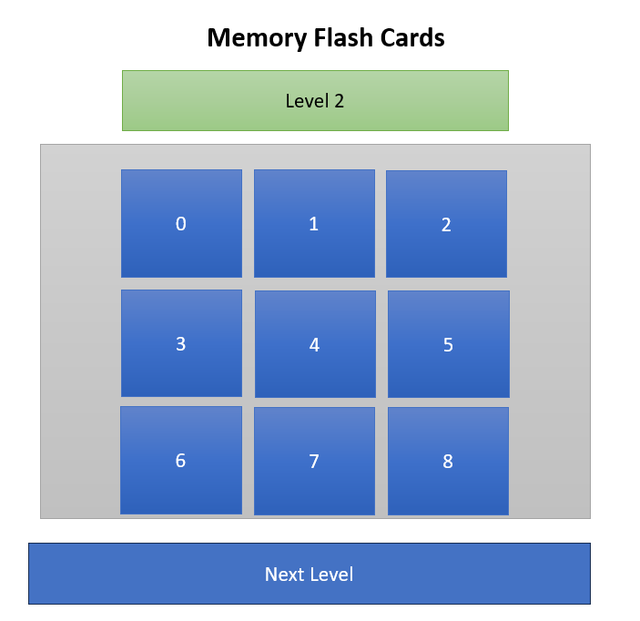

# Project Title [Memory Flash Cards]

# Date 6/29/2025

# By: Abdulla Zaid

# A brief Description of Project

Develop a memory-based card matching game with three progressive difficulty levels, each featuring two modes (Easy and Hard). The player must match hidden cards before they flip back, in order to win and allow the user higher levels with more cards and stricter requirements.

# Getting Started

1. Planning by Drawing

# Wireframes/Screenshot Design

# Pseudo-code

the game it will have 3 levels and every level will have tow modes[easy, hard]
in level 1 will have 4 box cards so the user should match 2 position of cards by clicking on 2 of 4 cards before Cards flip back if match is correct the user will won and the system will allow hem to go next level

in level 2 increasing cards box from 4 cards to 9 cards will have 9 box cards so the user should match 3 position of cards by clicking on 3 of 9 cards before Cards flip back if match is correct the user will won and the system will allow hem to go next level

in level 3 increasing cards box from 9 cards to 12 cards will have 12 box cards so the user should match 4 position of cards by clicking on 4 of 12 cards before Cards flip back if match is correct the user will won and the system will allow hem to go next level

in hard mode when the cards flip back in short time

in easy mode when the cards flip back in some second

# Lists/Tech used

- VS Code for Editing
- html
- JavaScript
- Game Logic

# source /reference/attributions

- [flaticon](https://www.flaticon.com/)
- [uicookies.com](https://codepen.io/chris22smith/pen/dOOrOP)
